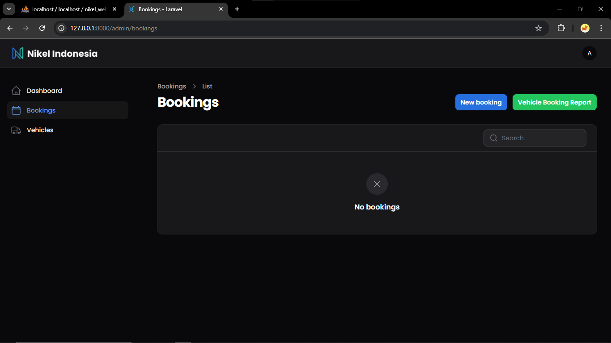

# Web Aplikasi Nikel Indonesia

## Informasi Project
- **Framework**: Laravel v11.3
- **Admin Panel**: Filament v3.2
- **PHP**: v8.2
- **Database**: MySQL v8.0

## Daftar Akun
Gunakan akun berikut untuk mengakses aplikasi web Nikel:

### Admin
- **Username**: `admin@example.com`
- **Password**: `password`

### Approver Level 1
- **Username**: `approve1@example.com`
- **Password**: `password`

### Approver Level 2
- **Username**: `approve2@example.com`
- **Password**: `password`

## Panduan Penggunaan Web Aplikasi
Ikuti langkah-langkah berikut untuk menggunakan web aplikasi Nikel:

1. Buka folder `nikel_web` di visual studio code. Kemudian buka terminal dan jalankan perintah `php artisan migrate` untuk menjalankan migrasi, dilanjutkan dengan menjalankan perintah `php artisan db:seed` untuk menjalankan seeder.

2. Setelah itu, jalankan perintah `php artisan serve` untuk menjalankan aplikasi web. Lalu buka alamat `http://localhost:8000/admin` di browser web.

3. Kita masuk di halaman `Login`, pertama kita login dengan akun `Admin` untuk melakukan pemesanan kendaraan.

    

4. Setelah itu, kita dapat melihat halaman `Dashboard`. Halaman ini menampilkan grafik kendaraan `Available` dan `Booked`. Saat ini, grafik menunjukkan kendaraan masih tersedia semua untuk dipesan.

    

5. Kemudian kita coba untuk memesan kendaraan dengan cara masuk ke halaman `Bookings` dan memilih `New Booking`.

    

6. Kita diminta mengisi form untuk memesan kendaraan. Setelah semua form terisi klik tombol `Create`.

    

7. Kembali ke halaman `Bookings` dan pesanan sudah berhasil dibuat. Kita lihat disini `Status` pesanan masih `Pending` karena masih belum disetujui oleh `Approver 1` dan `Approver 2`.

    

8. Setelah itu kita coba untuk menyetujui dengan cara login menggunakan `Approver 1` dan `Approver 2`. Disini kita login dengan `Approver 1` terlebih dahulu.

    

9. Kemudian kita masuk ke halaman `Bookings` dan klik tombol `Approve`. Setelah itu, pesanan sudah berhasil disetujui oleh `Approver 1` tapi statusnya masih `Pending` karena `Approver 2` belum menyetujui pesanan tersebut.

    
    

10. Lalu kita login kembali dengan akun `Approver 2`.

    

11. Kemudian kita masuk ke halaman `Bookings` dan klik tombol `Approve`. Setelah itu, pesanan sudah berhasil disetujui oleh `Approver 2` dan disini statusnya sudah berubah menjadi `Approved` karena `Approver 1` dan `Approver 2` sudah menyetujui pesanan tersebut.

    
    

12. Kita kembali lagi login menggunakan akun `Admin` dan masuk ke halaman `Bookings`. Bisa dilihat bahwa status pesanan sudah berubah menjadi `Approved`.

    

13. Pada halaman `Bookings` kita juga bisa mendownload `Laporan Pemesanan Kendaraan` dalam bentuk `Excel` dengan cara klik tombol `Vehicle Booking Report`. File akan di-download, dan kita bisa membukanya.

    
    
    

14. Kemudian terdapat juga halaman `Vehicles`. Di halaman ini kita bisa melihat berbagai informasi tentang kendaraan yang ada, mulai dari nama kendaraan, tipe kendaraan, owner kendaraan, konsumsi BBM, jadwal servis, dan status kendaraan. Kita bisa lihat terdapat `Status` kendaraan ada yang `Booked`, itu karena tadi kita telah memesan kendaraan tersebut.

    

15. Lalu kita kembali lagi masuk ke halaman `Dashboard` dan kita lihat bahwa grafik berubah karena sebelumnya kita berhasil memesan satu kendaraan.

    